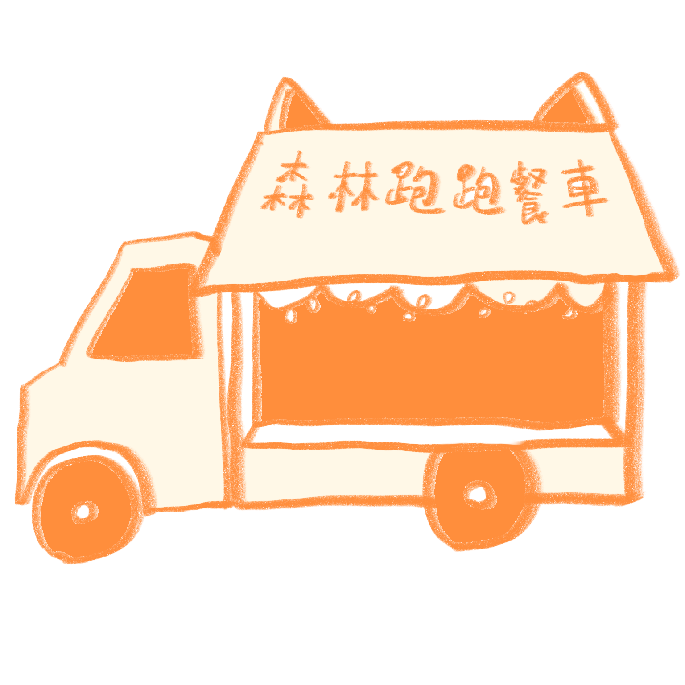
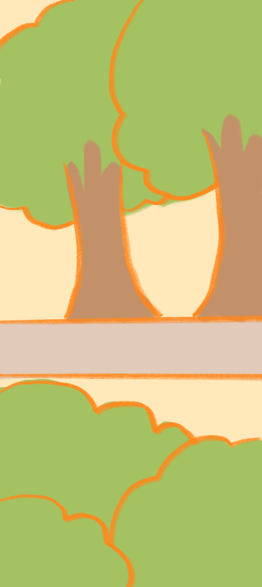
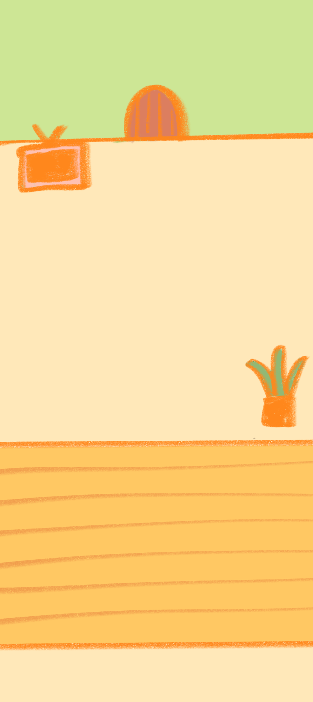
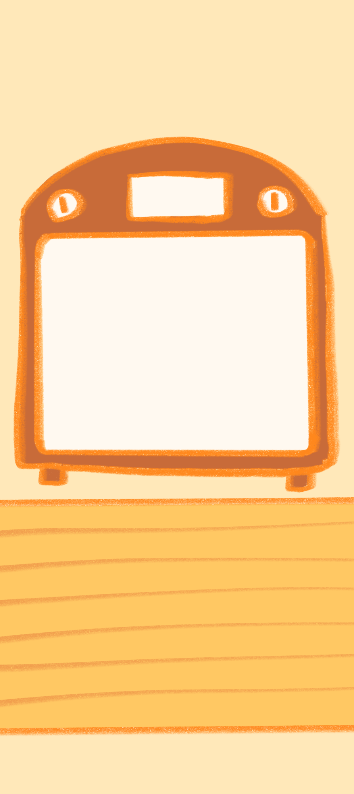
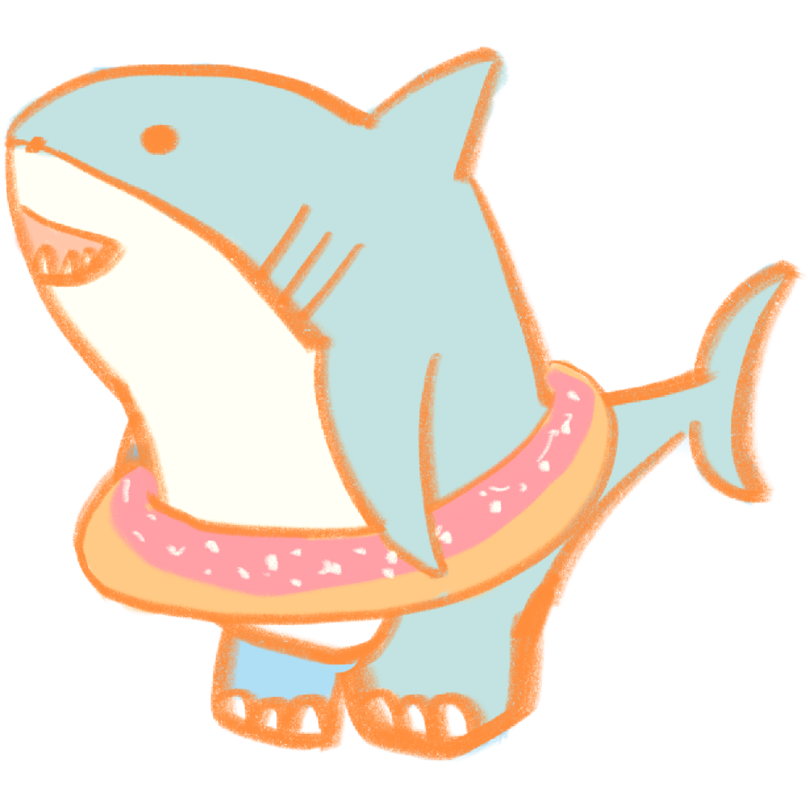
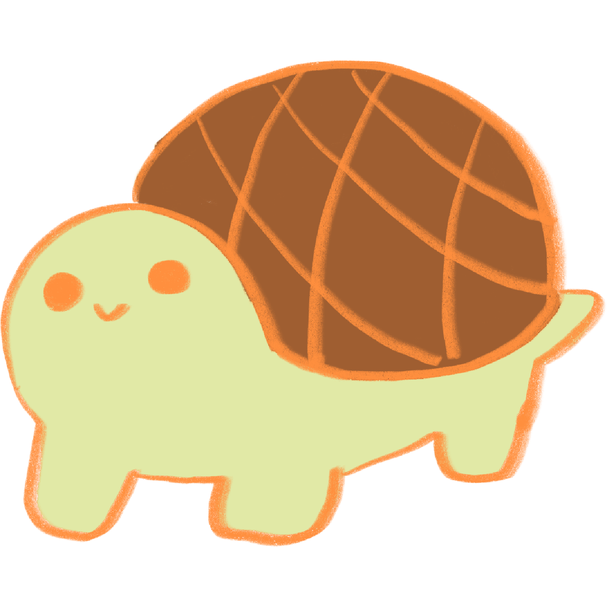

<div align="center">



# 森林跑跑餐車 Bake & Run

**把「跑步」變成「經營森林麵包餐車」的遊戲化運動 App**
你跑的每一條路線，都會出爐成一個獨一無二的麵包 🥐

<a href="https://mewneko-edu.github.io/foodtruck-run/"></a>

<a href="docs/game-design.md"></a> <a href="docs/UI_flow.md"></a> <a href="docs/企劃書.pdf"></a>

</div>

---

## 🌲 「森林跑跑餐車」是什麼？

你將成為魔法森林裡的烘焙師，開著一輛貓咪造型的移動麵包車。
這輛車的烤箱不插電——**燃料是你在現實世界跑步消耗的卡路里**。

森林裡的動物們因為生活壓力而無精打采，會到餐車前排隊，
等你用剛出爐的麵包治癒牠們。

> 我想解決的問題是：
> **能不能讓人「捨不得不去跑步」，而不是「逼自己去跑步」？**

## 🍞 核心循環

```
🏃 現實跑步 ──→ 🥖 出爐軌跡麵包＋食材 ──→ 🔥 廚房合成
                                              │
🛠️ 裝潢餐車 ←── 🪙 餵動物賺金幣 ←──────────────┘
      └──────「想要更多」，再回去跑步 ──→ 🏃
```

- **軌跡麵包**：跑完步，GPS 路線會被圖案化、烘焙成當次專屬的麵包形狀——繞圓跑會得到圓形麵包、河堤折返會獲得一根長長的麵包
- **拖曳餵食**：把麵包拖到動物身上即可餵食，口味符合需求泡泡即可獲得大量金幣
- **廚房合成**：原味軌跡麵包＋路上蒐集到的草莓、巧克力等食材 → 稀有特殊麵包
- **明信片收集**：完成動物的任務，解鎖專屬劇情與手繪明信片

## 🚚 三個房間

整個 App 就是一輛餐車，左右滑動穿梭三個空間：

| A・餐車外部 | B・餐廳內部（首頁） | C・廚房內部 |
|:---:|:---:|:---:|
|  |  |  |
| 按下 GO 鈕開始跑步 | 動物排隊・拖曳餵食 | 食材倉庫・合成台 |

## 🦈 森林裡的客人

| 鯊魚男孩 | 托托 | 小廷 |
|:---:|:---:|:---:|
|  |  |  |

餵飽牠們、聽牠們說話、完成牠們的心願，收集每一張明信片 💌

## 🎨 設計理念

以 Octalysis 八角框架的「白帽動機」為核心：

| 動機 | 取代 | 做法 |
|---|---|---|
| 同理心 | 自律壓力 | 「小動物餓了」取代「我該運動了」 |
| 創造感 | 冰冷數據 | GPS 路線 → 獨一無二的軌跡麵包 |
| 擁有感 | 排名競爭 | 稀有食材合成、圖鑑與明信片收集 |

唯一的黑帽是「三日離店機制」：三天沒跑步動物會陸續離開（可能錯失稀有客人），但再次跑步就會吸引新客人——壓力輕巧、永遠有回頭路。

## 🛠️ 技術與執行

純 HTML / CSS / JavaScript 單檔網頁原型，無任何外部依賴。

```bash
git clone https://github.com/mewneko-edu/foodtruck-run.git
cd foodtruck-run
open index.html   # 或直接用瀏覽器開啟
```

目前原型已實作：三房間橫滑介面、固定 HUD、動物排隊與需求泡泡、拖曳餵食與口味配對、動物對話與明信片系統、背景音樂／跑步音樂自動切換。

## 📁 專案結構

```
foodtruck-run/
├── index.html              # 遊戲本體（單檔原型）
├── docs/
│   ├── game-design.md      # 遊戲設計文件（Octalysis 分析、角色、數值）
│   ├── UI_flow.md          # UI Flow 與畫面清單（Mermaid 流程圖）
│   └── 企劃書.pdf           # 創意 App 點子企劃書
├── pic/                    # 遊戲美術（餐車、房間、客人、麵包、明信片）
└── music/                  # 背景音樂與跑步音樂
```

## 🎵 音樂來源

音樂素材來自 [DOVA-SYNDROME](https://dova-s.jp)（免費 BGM 素材網站）：

- 背景音樂：[Rain Drop](https://dova-s.jp/en/bgm/detail/23512) — えだまめ88
- 跑步音樂：[A peaceful everyday life](https://dova-s.jp/en/bgm/detail/23437) — junichirou
