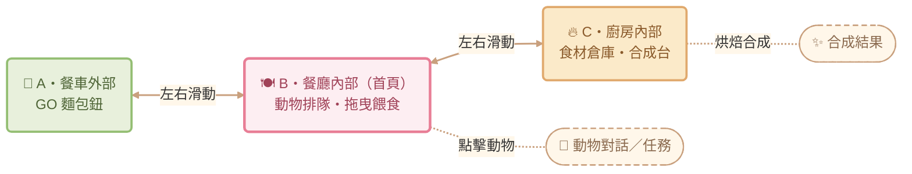
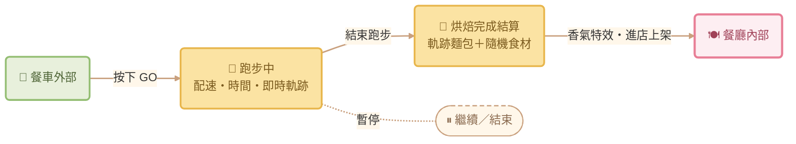

# 森林跑跑餐車 (Bake & Run) — UI Flow

本文件只負責「畫面與導航」；遊戲機制、動機設計與數值請見 [game-design.md](game-design.md)。

## 一、整體導航流程

採「一體化三房間橫向滑動」結構：餐車外部 ← 餐廳內部（首頁） → 廚房內部。
頂部 HUD（設定 / 圖鑑 / 金幣 / 步數）與底部裝潢鈕**固定不隨滑動改變**。

### 三房間橫滑與房間內互動

HUD 固定欄在任何房間都能開啟三個全頁 overlay：⚙️ 設定、📖 收藏圖鑑（麵包／食材／明信片／客人）、🛠️ 裝潢商城（外裝／內飾／廚房），返回後回到原房間。

### 跑步主流程

---

## 二、所有畫面清單

| # | 畫面 | 類型 | 入口 |
|---|---|---|---|
| 1 | A · 餐車外部 | 房間（橫滑） | 左滑 / 圓點 |
| 2 | B · 餐廳內部（首頁） | 房間（橫滑） | App 啟動預設 |
| 3 | C · 廚房內部 | 房間（橫滑） | 右滑 / 圓點 |
| 4 | 跑步中 | 全頁 overlay | 餐車外部 GO 鈕 |
| 5 | 烘焙完成結算 | 全頁 overlay | 跑步結束 |
| 6 | 收藏圖鑑 | 全頁 overlay | HUD 📖 |
| 7 | 裝潢商城 | 全頁 overlay | 底部 🛠️ |
| 8 | 設定 | 全頁 overlay | HUD ⚙️ |
| 9 | 暫停 | Popup | 跑步中暫停鈕 |
| 10 | 動物對話 / 任務 | Popup | 餐廳點動物 |
| 11 | 合成結果 | Popup | 廚房烘焙合成 |

3 個房間 + 5 個全頁 + 3 個 popup，互動畫面共 11 種。

---

## 三、值得注意的 UI 細節

**1. 一體化三房間橫滑**
不用底部 tab bar，三個餐車空間左右連通；HUD 與裝潢鈕固定，視覺上始終待在「同一輛餐車裡」，沉浸感更強。

**2. 跑步頁的即時軌跡**
跑步時下方線條會「即時畫出」，結束時這條路線直接變成結算頁上當次專屬的麵包形狀。

**3. 拖曳餵食**
從麵包籃把麵包拖到動物身上即可餵食，直覺、有即時回饋。口味是否符合需求泡泡會影響金幣量（數值見 [game-design.md](game-design.md)）。
