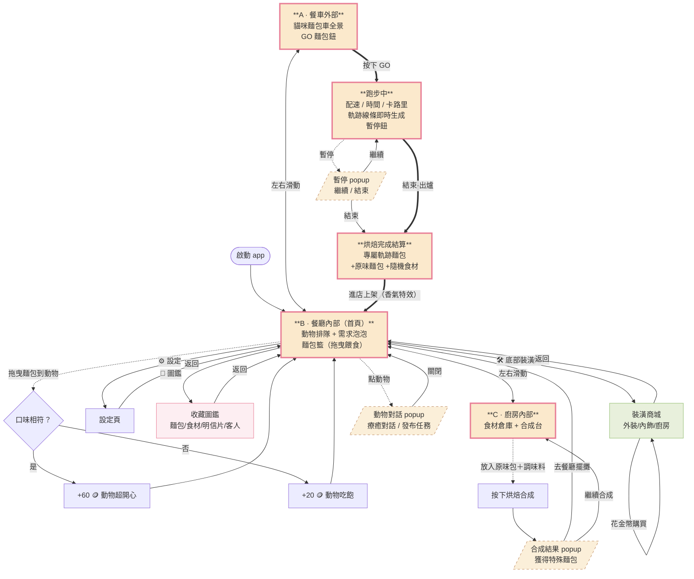
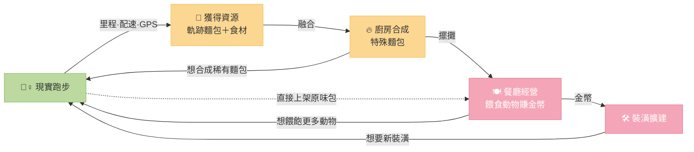

# 森林跑跑餐車 (Bake & Run) — UI Flow

## 一、整體導航流程

採「一體化三房間橫向滑動」結構：餐車外部 ← 餐廳內部（首頁） → 廚房內部。
頂部 HUD（設定 / 圖鑑 / 金幣 / 步數）與底部裝潢鈕**固定不隨滑動改變**。

---

## 二、核心循環（跑步 → 資源 → 經營 → 動機）

整個循環的設計核心是**白帽動機**：
- **同理心**：「動物餓了想被照顧」取代「我得去運動」的壓力
- **創造力**：GPS 路線 → 獨一無二的軌跡麵包形狀，數據變創作
- **擁有感**：稀有調味料合成、解鎖圖鑑與餐車裝潢

---

## 三、所有畫面清單

| # | 畫面 | 類型 | 入口 |
|---|---|---|---|
| 1 | A · 餐車外部 | 房間（橫滑） | 左滑 / 圓點 |
| 2 | B · 餐廳內部（首頁） | 房間（橫滑） | App 啟動預設 |
| 3 | C · 廚房內部 | 房間（橫滑） | 右滑 / 圓點 |
| 4 | 跑步中 | 全頁 overlay | 餐車外部 GO 鈕 |
| 5 | 烘焙完成結算 | 全頁 overlay | 跑步結束 |
| 6 | 收藏圖鑑 | 全頁 overlay | HUD 📖 |
| 7 | 裝潢商城 | 全頁 overlay | 底部 🛠️ |
| 8 | 設定 | 全頁 overlay | HUD ⚙️ |
| 9 | 暫停 | Popup | 跑步中暫停鈕 |
| 10 | 動物對話 / 任務 | Popup | 餐廳點動物 |
| 11 | 合成結果 | Popup | 廚房烘焙合成 |

3 個房間 + 5 個全頁 + 3 個 popup，互動畫面共 11 種。

---

## 四、值得注意的設計細節

**1. 一體化三房間橫滑**
不用底部 tab bar，三個餐車空間左右連通；HUD 與裝潢鈕固定，視覺上始終待在「同一輛餐車裡」，沉浸感更強。

**2. 軌跡麵包是核心亮點**
跑步時下方線條會「即時畫出」，結束時這條路線就變成當次專屬的麵包形狀——把枯燥的距離數據轉成獨一無二的收集物。

**3. 拖曳餵食 + 口味配對**
從麵包籃把麵包拖到動物身上即可餵食。口味符合需求泡泡 → 大量金幣（特殊麵包）；不符 → 基礎金幣。直覺、有即時正向回饋。

**4. 香氣防空店機制**
店內沒麵包動物會離開；跑步結束「進店上架」時冒出香氣特效，重新吸引動物——把「跑步」和「店裡熱鬧起來」直接接上。

**5. 兩段式音樂**
主畫面播背景音樂，進入跑步模式自動切換成跑步音樂，出爐後切回。HUD 與設定頁都能開關。

**6. 經濟循環收束在裝潢**
餵食賺的金幣用於裝潢商城，改變三個房間的視覺場景，強化長期留存與成就感。
