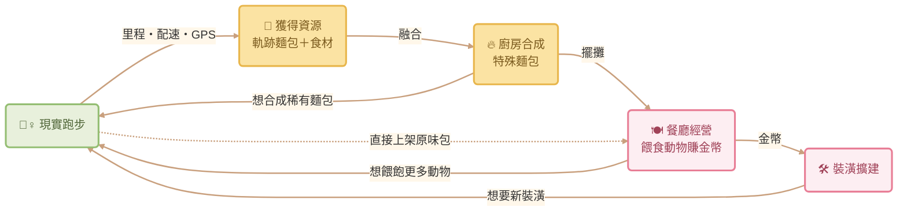

# 森林跑跑餐車 (Bake & Run) — 遊戲設計文件

透過「遊戲化設計 (Gamification)」，將枯燥、需要高度自律的跑步運動，轉化為溫馨、具備即時正向回饋的餐車經營遊戲。藉由同理心與創造感，提升用戶的每日運動動機。

---

## 一、核心概念與世界觀

* **專案名稱：** 森林跑跑餐車 (Bake & Run)
* **目標受眾：** 慢跑新手、欲培養運動習慣的大眾、喜愛療癒經營與收集要素的玩家
* **視覺風格：** 溫暖馬卡龍色系、手繪/蠟筆質感 UI、擬人化森林動物
* **故事背景：** 玩家扮演一位來到魔法森林的烘焙師，經營著一輛「移動式貓咪麵包車」。這輛餐車的烤箱不消耗電力，唯一的能源是玩家在現實生活中運動所燃燒的「卡路里」與「GPS 軌跡」。森林裡住著各式各樣因為生活壓力而失去活力的動物，玩家必須透過跑步收集食材、烘焙麵包來治癒牠們。

---

## 二、遊戲化設計（Octalysis 八角框架）

設計以「白帽動機（正面且具包容性）」為核心：

1. **創造力與回饋 (Core Drive 3)：** 玩家的「跑步路線圖」會直接轉化為「麵包的外觀形狀」，讓數據具備獨一無二的創作價值。
2. **社會影響力與同理心 (Core Drive 5)：** 利用「小動物餓了、需要被照顧」的心理，將「我必須去運動」的壓力，轉化為「我想去餵飽牠們」的溫馨動機。
3. **擁有感與佔有慾 (Core Drive 4)：** 跑步撿到的特殊調味料可以用於廚房合成，解鎖稀有圖鑑與餐車裝潢外觀。

### 唯一的黑帽：三日離店機制 (Core Drive 8)

連續三天沒有跑步，動物會陸續離開餐車——可能錯失稀有客人與牠們帶來的獎勵。但只要再次跑步，香氣就會吸引新的客人上門（不一定是原本的稀有客人）。

與傳統運動 App「連續紀錄中斷歸零」的設計不同，這個機制壓力輕巧、永遠有回頭路：失去的是「機會」而不是「累積的成果」，不會讓玩家因為中斷一次就想放棄。

---

## 三、核心遊戲循環 (Core Loop)

---

## 四、三大空間的玩法定位

遊戲分為左、中、右三個互相連通的餐車空間（畫面導航與 HUD 配置見 [UI_flow.md](UI_flow.md)）：

### A：餐車外部 — 跑步起點

* 按下 GO 按鈕進入跑步模式，累積里程、配速與 GPS 軌跡

### B：餐廳內部（主首頁）— 經營與動物互動

* **動物排隊 AI：** 座位上的動物頭上會冒出「飢餓需求泡泡」（例如：想吃巧克力麵包）
* **拖曳餵食：** 將麵包拖曳至動物身上即可餵食，獲得金幣
* **對話系統：** 點擊動物可觸發療癒對話；特定動物會發布任務（如：募集 5 個草莓麵包），完成後解鎖特殊劇情與明信片獎勵
* **香氣機制（防空店）：** 店內無麵包時動物會全數離開；跑步結束或有新麵包上架時，餐車冒出香氣特效，重新吸引動物進店

### C：廚房內部 — 研發與合成

* **合成台：** 將「原味軌跡麵包」與「調味料」放入烤箱，融合成高單價特殊麵包

---

## 五、角色設定

| 角色 | 想吃的口味 | 備註 |
|---|---|---|
| 鯊魚男孩 | 巧克力麵包 | 有專屬對話、任務與明信片 |
| 托托 | 牛奶波羅 | 烏龜，有專屬明信片 |
| 小廷 | 咖哩麵包 | 有專屬明信片 |
| 兔子、熊、貓 等 | 草莓／巧克力／原味 | 一般客人 |

---

## 六、核心機制與數值

### 1. 跑步結束結算

按下結束跑步時，觸發「烘焙完成彈窗」：

* **基礎獎勵：** 根據里程與配速換算，獲得原味麵包與隨機調味料
* **核心亮點（專屬軌跡麵包）：** 系統抓取本次跑步的 GPS 路線圖，將線條加粗、圖案化，生成當次跑步獨一無二的「圖案軌跡麵包」（例如：繞操場跑會獲得圓形的甜甜圈軌跡包）

### 2. 經濟循環

| 麵包 | 餵食金幣 |
|---|---|
| 原味軌跡麵包 | 20 🪙 |
| 牛奶波羅 | 55 🪙 |
| 草莓／巧克力／咖哩（合成特殊麵包） | 60 🪙 |

* 口味符合動物的需求泡泡 → 獲得特殊麵包的高額金幣；不符 → 基礎金幣
* **金幣用途：** 用於【裝潢商城】購買餐車外觀與內部家具，改變三個滑動頁面的視覺場景，強化長期留存與成就感

### 3. 音樂設計

主畫面播放溫馨背景音樂；進入跑步模式自動切換為節奏感跑步音樂，出爐後切回。HUD 與設定頁皆可開關。

**音樂來源**（[DOVA-SYNDROME](https://dova-s.jp) 免費 BGM 素材）：

* 背景音樂：[Rain Drop](https://dova-s.jp/en/bgm/detail/23512) — えだまめ88
* 跑步音樂：[A peaceful everyday life](https://dova-s.jp/en/bgm/detail/23437) — junichirou

---

## 七、未來展望

### 短期目標

* **實際開發為手機 App**：串接 GPS 與健康資料（HealthKit / Google Fit），讓跑步數據真實驅動遊戲
* **軌跡麵包生成演算法**：將 GPS 路線圖形化、轉換為麵包形狀的核心技術實作
* **介面優化與美術精緻化**：打磨操作手感、動畫細節與手繪美術品質

### 內容擴充

* **更多角色、麵包與食材**：擴充森林動物圖鑑與合成配方，深化收集樂趣
* **故事內容編寫**：為每位動物撰寫背景故事與任務劇情線，累積情感連結
* **季節限定活動**：節慶限定食材與裝潢（如聖誕薑餅、中秋月餅），維持長期新鮮感

### 長期方向

* **輕社交分享**：軌跡麵包與明信片可輸出成圖卡分享、好友互訪餐車送麵包——刻意不做排行榜與競爭，維持白帽理念
* **溫柔推播**：「小動物想念你了」式的提醒通知，呼應三日離店機制，與一般運動 App 的罪惡感推播做出區隔
